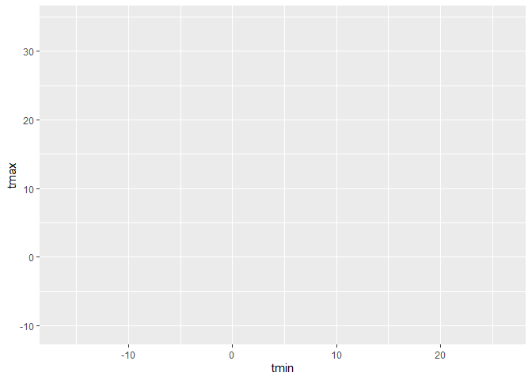

visualization\_1
================
Jingyi
10/4/2019

## Part 1

Good visualization is a critical step in data analysis.

``` r
library(tidyverse)
```

    ## -- Attaching packages ----------------------- tidyverse 1.2.1 --

    ## v ggplot2 3.2.1     v purrr   0.3.2
    ## v tibble  2.1.3     v dplyr   0.8.3
    ## v tidyr   1.0.0     v stringr 1.4.0
    ## v readr   1.3.1     v forcats 0.4.0

    ## -- Conflicts -------------------------- tidyverse_conflicts() --
    ## x dplyr::filter() masks stats::filter()
    ## x dplyr::lag()    masks stats::lag()

``` r
library(ggridges)
```

    ## 
    ## Attaching package: 'ggridges'

    ## The following object is masked from 'package:ggplot2':
    ## 
    ##     scale_discrete_manual

``` r
library(hexbin)
```

We’ll be working with NOAA weather data, which is **downloaded** using
*rnoaa::meteo\_pull\_monitors function* in the code chunk below; similar
code underlies the weather dataset used elsewhere in the course. Because
this process can take some time, I’ll cache the code chunk.

``` r
weather_df = 
  # in ronaa library find meteo_pull_monitors with the following three things
  rnoaa::meteo_pull_monitors(c("USW00094728", "USC00519397", "USS0023B17S"),
                      # the variable is PRCP, TMIN and TMAX
                      var = c("PRCP", "TMIN", "TMAX"), 
                      # the date minimum as followed
                      date_min = "2017-01-01",
                      # the data maximum as followed, and then
                      date_max = "2017-12-31") %>%
   # add a varible called name that id = "xx" with a new variable with its specific xx observation of the varible "name"
   mutate(
    name = recode(id, USW00094728 = "CentralPark_NY", 
                      USC00519397 = "Waikiki_HA",
                      USS0023B17S = "Waterhole_WA"),
    # tmin is the old tmin/10
    tmin = tmin / 10,
    # tmax is the old tmax/10 and then
    tmax = tmax / 10) %>%
  # put variables as order: name, id, and then everything else
  select(name, id, everything())
```

    ## Registered S3 method overwritten by 'crul':
    ##   method                 from
    ##   as.character.form_file httr

    ## Registered S3 method overwritten by 'hoardr':
    ##   method           from
    ##   print.cache_info httr

    ## file path:          C:\Users\Jingyi\AppData\Local\rnoaa\rnoaa\Cache/ghcnd/USW00094728.dly

    ## file last updated:  2019-10-04 20:34:21

    ## file min/max dates: 1869-01-01 / 2019-10-31

    ## file path:          C:\Users\Jingyi\AppData\Local\rnoaa\rnoaa\Cache/ghcnd/USC00519397.dly

    ## file last updated:  2019-10-04 20:34:37

    ## file min/max dates: 1965-01-01 / 2019-10-31

    ## file path:          C:\Users\Jingyi\AppData\Local\rnoaa\rnoaa\Cache/ghcnd/USS0023B17S.dly

    ## file last updated:  2019-10-04 20:34:43

    ## file min/max dates: 1999-09-01 / 2019-10-31

``` r
# show the dataset
weather_df
```

    ## # A tibble: 1,095 x 6
    ##    name           id          date        prcp  tmax  tmin
    ##    <chr>          <chr>       <date>     <dbl> <dbl> <dbl>
    ##  1 CentralPark_NY USW00094728 2017-01-01     0   8.9   4.4
    ##  2 CentralPark_NY USW00094728 2017-01-02    53   5     2.8
    ##  3 CentralPark_NY USW00094728 2017-01-03   147   6.1   3.9
    ##  4 CentralPark_NY USW00094728 2017-01-04     0  11.1   1.1
    ##  5 CentralPark_NY USW00094728 2017-01-05     0   1.1  -2.7
    ##  6 CentralPark_NY USW00094728 2017-01-06    13   0.6  -3.8
    ##  7 CentralPark_NY USW00094728 2017-01-07    81  -3.2  -6.6
    ##  8 CentralPark_NY USW00094728 2017-01-08     0  -3.8  -8.8
    ##  9 CentralPark_NY USW00094728 2017-01-09     0  -4.9  -9.9
    ## 10 CentralPark_NY USW00094728 2017-01-10     0   7.8  -6  
    ## # ... with 1,085 more rows

We’ll start with a basic scatterplot to develop our understanding of
ggplot’s data + mappings + geoms approach, and build quickly from there.

## \*Basic scatterplot

We’ll use the weather\_df data throughout, so we’ll move straight into
defining aesthetic mappings. To create a basic scatterplot, we need to
map variables to the X and Y coordinate aesthetics:

``` r
ggplot(weather_df, aes(x = tmin, y = tmax))
```

<!-- -->

Well, my “scatterplot” is blank. That’s because I’ve defined the data
and the aesthetic mappings, but haven’t added any geoms: ggplot knows
what data I want to plot and how I want to map variables, but not what I
want to show. Below I add a geom to define my first scatterplot.

``` r
ggplot(weather_df, aes(x = tmin, y = tmax)) + geom_point()
```

    ## Warning: Removed 15 rows containing missing values (geom_point).

<!-- -->

The code below could be used instead to produce the same figure. Using
this style can be helpful if you want to do **some pre-processing before
making your plot but don’t want to save the intermediate data**.

``` r
weather_df %>% 
  ggplot(aes(x = tmin, y = tmax)) +
  geom_point()
```

    ## Warning: Removed 15 rows containing missing values (geom_point).

<!-- -->

Notice that we try to use good styling practices here as well – new plot
elements are added on new lines, code that’s part of the same sequence
is indented, we’re making use of whitespace, etc.

You can also save the output of ggplot() to an object and modify / print
it later. This is often helpful, although it’s not my default approach
to making plots.

``` r
plot_weather = 
  weather_df %>% 
  ggplot(aes(x = tmin, y = tmax))

plot_weather + geom_point()
```

    ## Warning: Removed 15 rows containing missing values (geom_point).

<!-- -->

## \*\* Advanced scatterplot

The basic scatterplot gave some useful information – the variables are
related roughly as we’d expect, and there aren’t any obvious outliers to
investigate before moving on. We do, however, have other variables to
learn about using additional aesthetic mappings.

Let’s start with name, which I can incorporate using the color
aesthetic:

``` r
ggplot(weather_df, aes(x = tmin, y = tmax)) +
  geom_point(aes(color = name))
```

    ## Warning: Removed 15 rows containing missing values (geom_point).

<!-- -->

``` r
# give different colors to different data value according to different names observation
```

Nice\! We get colors and have a handly legend. Maybe next I’ll add a
smooth curve and make the data points a bit transparent.

``` r
ggplot(weather_df, aes(x = tmin, y = tmax)) +
  geom_point(aes(color = name), alpha = .5) +
  geom_smooth(se = FALSE)
```

    ## `geom_smooth()` using method = 'gam' and formula 'y ~ s(x, bs = "cs")'

    ## Warning: Removed 15 rows containing non-finite values (stat_smooth).

    ## Warning: Removed 15 rows containing missing values (geom_point).

<!-- -->

Neat\! The curve gives a sense of the relationship between variables,
and the transparency shows where data are overlapping. I can’t help but
notice, though, that the **smooth curve is for all the data** but the
**colors are only for the scatterplot**. Turns out that this is due to
where I defined the mappings. The X and Y mappings apply to the whole
graphic, but **color is currently geom-specific**. Sometimes you want or
need to do this, but for now I don’t like it. If I’m honest, I’m also
having a hard time seeing everything on one plot, so I’m going to **add
facet based on name** as well.

``` r
# divide the plots into three parts for three different name variable values and a smooth curve for each part
ggplot(weather_df, aes(x = tmin, y = tmax, color = name))+
  geom_point(alpha = 0.5) +
  geom_smooth(se = FALSE) +
  facet_grid(.~name)
```

    ## `geom_smooth()` using method = 'loess' and formula 'y ~ x'

    ## Warning: Removed 15 rows containing non-finite values (stat_smooth).

    ## Warning: Removed 15 rows containing missing values (geom_point).

<!-- -->

``` r
##########################################################
#Question: what's the difference from adding the . or not?
```

Awesome\! I’ve learned a lot about these data. However, the relationship
between minimum and maximum temperature is now kinda boring, so I’d
prefer something that **shows the time of year**. Also I want to learn
about **precipitation**, so let’s do that.

``` r
ggplot(weather_df, aes(x = date, y = tmax, color = name)) + 
  geom_point(aes(size = prcp), alpha = 0.5) +
  geom_smooth(se = FALSE) +
  facet_grid(. ~ name)
```

    ## `geom_smooth()` using method = 'loess' and formula 'y ~ x'

    ## Warning: Removed 3 rows containing non-finite values (stat_smooth).

    ## Warning: Removed 3 rows containing missing values (geom_point).

<!-- -->

Way more interesting\! You get a whole range of temperatures in Central
Park (sometimes it’s maybe too hot); it’s more temperate near Seattle
but it rains all the time; and Waikiki is great except for that a few
(relatively) cold, rainy days.

## *Learning Assessment:*

Write a code chain that starts with weather\_df; focuses only on Central
Park, converts temperatures to Fahrenheit, makes a scatterplot of min
vs. max temperature, and overlays a linear regression line (using
options in geom\_smooth())

``` r
weather_df %>% 
  # the name variable has to have "" marks around
  filter(name == "CentralPark_NY") %>% 
  mutate(tmax_fahr = tmax*(9 / 5) + 32,
         tmin_fahr = tmin*(9 / 5) + 32) %>% 
  ggplot(aes(x = tmin_fahr, y = tmax_fahr)) +
  geom_point(alpha = 0.5) +
  geom_smooth(method = "lm", se = FALSE)
```

<!-- -->

## **Tips and Tricks**

There are lots of ways you can mix and match elements, depending on your
goals. I don’t like the following plot as much (it doesn’t show the data
and omits precipitation), but it illustrates that you have lots of
freedom in determining which geoms to include and how to compare your
groups. If nothing else, you should be starting to get a sense for why
you create way more plots for yourself than for others.

``` r
ggplot(weather_df, aes(x = date, y = tmax, color = name)) +
  geom_smooth(se = FALSE)
```

    ## `geom_smooth()` using method = 'loess' and formula 'y ~ x'

    ## Warning: Removed 3 rows containing non-finite values (stat_smooth).

<!-- -->

When you’re making a scatterplot with lots of data, there’s a limit to
how much you can avoid overplotting using alpha levels and transparency.
In these cases geom\_hex(), geom\_bin2d(), or geom\_density2d() can be
handy:

``` r
ggplot(weather_df, aes(x = tmax, y = tmin)) + 
  geom_hex()
```

    ## Warning: Removed 15 rows containing non-finite values (stat_binhex).

<!-- -->

``` r
ggplot(weather_df, aes(x = tmax, y = tmin)) + 
  geom_bin2d()
```

    ## Warning: Removed 15 rows containing non-finite values (stat_bin2d).

<!-- -->

``` r
ggplot(weather_df, aes(x = tmax, y = tmin)) + 
  geom_density2d()
```

    ## Warning: Removed 15 rows containing non-finite values (stat_density2d).

<!-- -->

There are lots of aesthetics, and these depend to some extent on the
geom – color worked for both geom\_point() and geom\_smooth(), but shape
only applies to points. The help page for each geom includes a list of
understood aesthetics.

## *Learning Assessment:*

In the preceding, we set the alpha aesthetic “by hand” instead of
mapping it to a variable. This is possible for other aesthetics too. To
check your understanding of this point, try to explain why the two lines
below don’t produce the same result:

``` r
ggplot(weather_df) + geom_point(aes(x = tmax, y = tmin), color = "blue")
```

    ## Warning: Removed 15 rows containing missing values (geom_point).

<!-- -->

``` r
ggplot(weather_df) + geom_point(aes(x = tmax, y = tmin, color = "blue"))
```

    ## Warning: Removed 15 rows containing missing values (geom_point).

<!-- -->

In the first attempt, we’re defining the color of the points by hand; In
the second attempt, we’re implicitly creating a color variable that has
the value blue everywhere; ggplot is then assigning colors according to
this variable using the default color scheme.

## **Univariate Plots**

Scatterplots are great, but sometimes you need to carefully understand
the distribution of single variables – we’ll tackle that now. This is
primarily an issue of learning some new geoms and, where necessary, some
new aesthetics.

First up is the histogram.

``` r
ggplot(weather_df, aes(x = tmax)) +
  geom_histogram()
```

    ## `stat_bin()` using `bins = 30`. Pick better value with `binwidth`.

    ## Warning: Removed 3 rows containing non-finite values (stat_bin).

<!-- -->

You can play around with things like the bin width and set the fill
color using an aesthetic mapping.

``` r
                                # 根据name变量赋予不同颜色
ggplot(weather_df, aes(x = tmax, fill = name)) +
  geom_histogram(position = "dodge", binwidth = 2)
```

    ## Warning: Removed 3 rows containing non-finite values (stat_bin).

<!-- -->

``` r
                  # 每个颜色的条条分开
                                    # 设定binwidth
```

The position = “dodge” places the bars for each group side-by-side, but
this gets sort of hard to understand. I often prefer density plots in
place of histograms.

``` r
ggplot(weather_df, aes(x = tmax, fill = name)) +
  geom_density(alpha = 0.4, adjust = 0.5, color = "blue")
```

    ## Warning: Removed 3 rows containing non-finite values (stat_density).

<!-- -->

The **adjust** parameter in density plots is similar to the binwidth
parameter in histograms, and it helps to try a few values. I set the
transparency level to .4 to make sure all densities appear. You should
also **note the distinction between fill and color aesthetics here**.
You could facet by name as above but would have to ask if that makes
comparisons easier or harder. Lastly, adding *geom\_rug()* to a density
plot can be a helpful way to show the raw data in addition to the
density.

``` r
ggplot(weather_df, aes(x = tmax, fill = name)) +
  geom_density(alpha = 0.4, adjust = 0.5, color = "blue") +
  geom_rug() +
  facet_grid(. ~ name)
```

    ## Warning: Removed 3 rows containing non-finite values (stat_density).

<!-- -->

Histograms and densities are one way of investigating univariate
distributions; boxplots are another.

``` r
ggplot(weather_df, aes(x = name, y = tmax)) +
  geom_boxplot()
```

    ## Warning: Removed 3 rows containing non-finite values (stat_boxplot).

<!-- -->

Violin plots are sometimes nice, but folks complain that they don’t look
like violins.

``` r
ggplot(weather_df, aes(x = name, y = tmax)) +
  geom_violin(aes(fill = name), color = "blue", alpha = 0.5) +
  stat_summary(fun.y = median, geom = "point", color = "blue", size = 4)
```

    ## Warning: Removed 3 rows containing non-finite values (stat_ydensity).

    ## Warning: Removed 3 rows containing non-finite values (stat_summary).

<!-- -->

Ridge plots were the trendiest plot of 2017, and were a replacement for
both boxplots and violin plots. They’re implemented in the ggridges
package, and are nice if you have lots of categories in which the shape
of the distribution matters.

``` r
ggplot(weather_df, aes(x = tmax, y = name)) +
  geom_density_ridges(scale = 0.85)
```

    ## Picking joint bandwidth of 1.84

    ## Warning: Removed 3 rows containing non-finite values (stat_density_ridges).

<!-- -->

## *Learning Assessment:*

Make plots that compare precipitation across locations. Try a histogram,
a density plot, a boxplot, a violin plot, and a ridgeplot; use aesthetic
mappings to make your figure readable.

``` r
# histogram
ggplot(weather_df, aes(x = prcp, fill = name)) +
  geom_histogram(position = "dodge", binwidth = 2)
```

    ## Warning: Removed 3 rows containing non-finite values (stat_bin).

<!-- -->

``` r
# density
ggplot(weather_df, aes(x = prcp)) +
  geom_density(aes(fill = name), alpha = 0.5)
```

    ## Warning: Removed 3 rows containing non-finite values (stat_density).

<!-- -->

``` r
# ridge plot
ggplot(weather_df, aes(x = prcp, y = name)) +
  geom_density_ridges(scale = 0.85)
```

    ## Picking joint bandwidth of 4.61

    ## Warning: Removed 3 rows containing non-finite values (stat_density_ridges).

<!-- -->

``` r
# boxplot
ggplot(weather_df, aes(y = prcp, x = name)) +
  geom_boxplot()
```

    ## Warning: Removed 3 rows containing non-finite values (stat_boxplot).

<!-- -->

This is a tough variable to plot because of the highly skewed
distribution in each location. Of these, I’d probably choose the boxplot
because it shows the outliers most clearly. If the “bulk” of the data
were interesting, I’d probably compliment this with a plot showing data
for all precipitation less than 100, or for a data omitting days with no
precipitation.

``` r
weather_df %>% 
  filter(prcp > 0) %>% 
  ggplot(aes(x = prcp, y = name)) + 
  geom_density_ridges(scale = .85)
```

    ## Picking joint bandwidth of 19.7

<!-- -->

## **Saving and Embedding Plots**

You will, on occasion, need to save a plot to a specific file. **Don’t
use the built-in “Export” button\!** If you do, your figure is not
reproducible – no one will know how your plot was exported. Instead,
**use ggsave()** by explicitly creating the figure and exporting; ggsave
will guess the file type you prefer and has options for specifying
features of the plot. In this setting, it’s often helpful to save the
ggplot object explicitly and then export it (using relative paths\!).

``` r
#########################################################
# Something wrong with this

weather_plot = ggplot(weather_df, aes(x = tmin, y = tmax)) + 
  geom_point(aes(color = name), alpha = .5) 

ggsave("weather_plot.pdf", weather_plot, width = 8, height = 5)
```

    ## Warning: Removed 15 rows containing missing values (geom_point).

Embedding plots in an R Markdown document can also take a while to get
used to, because there are several things to adjust. First is the size
of the figure created by R, which is controlled using two of the three
chunk options fig.width, fig.height, and fig.asp. I prefer a common
width and plots that are a little wider than they are tall, so I set
options to fig.width = 6 and fig.asp = .6. Second is the size of the
figure inserted into your document, which is controlled using out.width
or out.height. I like to have a little padding around the sides of my
figures, so I set out.width = “90%”. I do all this by including the
following in a code snippet at the outset of my R Markdown documents.

``` r
knitr::opts_chunk$set(
  fig.width = 6,
  fig.asp = .6,
  out.width = "90%"
)
```

What makes embedding figures difficult at first is that things like the
font and point size in the figures generated by R are constant – that
is, they don’t scale with the overall size of the figure. As a result,
text in a figure with width 12 will look smaller than text in a figure
with width 6 after both have been embedded in a document. As an example,
the code chunk below has set fig.width = 12.

``` r
knitr::opts_chunk$set(
  fig.width = 12,
  fig.asp = .6,
  out.width = "90%"
)

ggplot(weather_df, aes(x = tmin, y = tmax)) + 
  geom_point(aes(color = name))
```

    ## Warning: Removed 15 rows containing missing values (geom_point).


